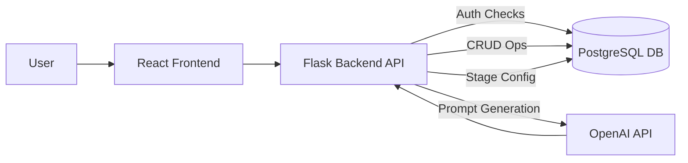

# Architecture Overview

## System Diagram

*(This is a simplified view)*

## Key Components

1.  **React Frontend (`/front-end`)**
    *   Technology: React, Material UI (MUI), react-router-dom.
    *   Responsibilities: User interface for configuration, business/stage management (future), displaying conversations.
    *   Authentication: Sends credentials (`userId`, `businessId`, `businessApiKey`) to `/api/save-config` to obtain the `businessApiKey` cookie. Relies on this cookie for subsequent requests.
2.  **Flask Backend API (`/backend`)**
    *   Technology: Flask, Python.
    *   Responsibilities: Handles all API requests, performs authentication/authorization, interacts with the database, orchestrates calls to OpenAI API.
    *   Key Modules:
        *   `app.py`: Main application entry point, registers blueprints, handles config saving.
        *   `auth.py`: Contains `@require_api_key` and `@require_business_api_key` decorators.
        *   `db.py`: Manages PostgreSQL connection pool.
        *   `config.py`: Loads configuration from environment variables.
        *   `routes/`: Contains blueprints defining API endpoints for different resources (businesses, stages, messages, etc.).
        *   `schemas/`: Contains JSON schemas used for request validation.
        *   `openai_helper.py`: (Assumed) Contains functions to interact with the OpenAI API (`call_openai`).
3.  **PostgreSQL Database**
    *   Technology: PostgreSQL.
    *   Responsibilities: Stores structured data for businesses, users, stages (including template configs), conversations, default templates.
    *   Schema: Defined in `documentation/DATABASE_SCHEMA.md`.
4.  **OpenAI API**
    *   Technology: External Service.
    *   Responsibilities: Provides LLM capabilities for the three-prompt system (stage selection, data extraction, response generation).
    *   Interaction: Called via `openai_helper.call_openai` (or similar) from the backend.

## Data Flow Example (Message Handling)

1.  User sends message via Frontend.
2.  Frontend makes `POST /message` request (includes `businessApiKey` cookie).
3.  Backend API receives request.
4.  `@require_business_api_key` decorator in `auth.py` validates the cookie against the `business_id` in the request body and the `businesses` table.
5.  `message_handling.py` route handler is invoked.
6.  Handler fetches relevant stage configuration (e.g., `stage_selection`, `data_extraction`) from the `stages` table in DB (using `business_id`).
7.  Handler potentially fetches conversation context/history from DB.
8.  Handler formats prompts using fetched stage config and context.
9.  Handler calls OpenAI API via `openai_helper.py` for selection, extraction, response generation steps.
10. Handler logs conversation details to DB.
11. Handler returns final response to Frontend.
12. Frontend displays response to User.

## Deployment (Planned/TBD)

*   [Describe planned deployment strategy - e.g., Docker containers, Cloud Provider (AWS, GCP, Azure), Serverless, etc.]
*   [Mention CI/CD pipeline if planned]

*(This overview can be expanded with details on specific libraries, scalability considerations, and security measures as the project evolves)* 