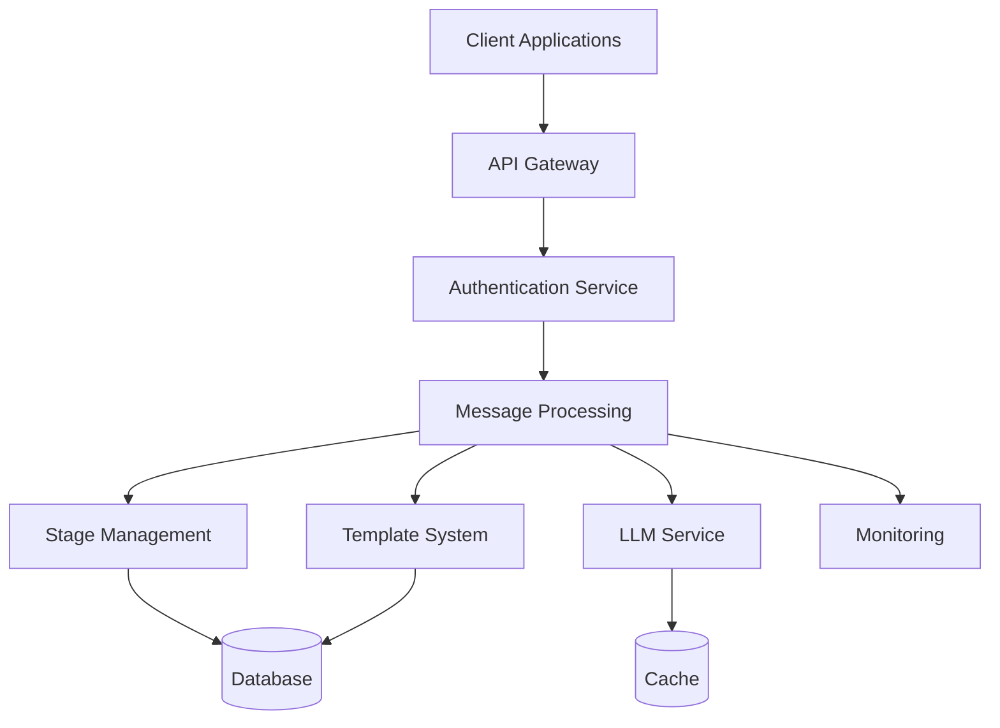

# Intelligent Conversation Management Platform (ICMP) - Implementation Guide

**Date:** March 22, 2024  
**Version:** 2.0  
**Purpose:** Comprehensive reference for implementing and maintaining the ICMP platform

## Table of Contents
1. Project Overview
2. Architecture
3. Core Components
4. API Structure
5. Authentication & Security
6. Message Processing
7. Template System
8. Stage Management
9. Testing Strategy
10. Deployment & Operations
11. Monitoring & Maintenance

## 1. Project Overview

The ICMP platform is a scalable, multi-agent conversation system that leverages LLMs to automate and enhance customer interactions. The system supports:
- Business onboarding and tenant isolation
- Product/service catalog management
- Customizable conversation stages
- Intelligent message processing
- Multi-agent routing
- Robust analytics

### 1.1 Core Features
- Multi-tenant architecture
- Template-based message processing
- Stage-based conversation flow
- AI-powered response generation
- Real-time analytics
- Platform integrations (Facebook, WhatsApp, etc.)

## 2. Architecture

### 2.1 System Components


### 2.2 Technology Stack
- **Backend**: Python, Flask
- **Database**: PostgreSQL
- **Cache**: Redis
- **AI**: OpenAI API
- **Frontend**: React, Material UI
- **Monitoring**: Prometheus, Grafana

## 3. Core Components

### 3.1 Message Processing
The message processing system is the core of ICMP, handling:
- Message reception and validation
- Stage selection and management
- Template application
- Response generation
- Conversation tracking

Key components:
- `MessageHandler`: Orchestrates message processing
- `StageService`: Manages conversation stages
- `TemplateService`: Handles template operations
- `LLMService`: Interfaces with AI models

### 3.2 Template System
The template system provides flexible message generation:
- Variable substitution
- Context-aware templates
- Multi-stage templates
- Default templates

See [Template System Documentation](template_system.md) for details.

### 3.3 Stage Management
The stage system enables:
- Dynamic conversation flow
- Stage-specific processing
- Data extraction
- Response generation

See [Stage Management Documentation](stage_management.md) for details.

## 4. API Structure

### 4.1 Core Endpoints
- `/api/message`: Message processing
- `/api/stages`: Stage management
- `/api/templates`: Template management
- `/api/businesses`: Business operations
- `/api/auth`: Authentication

See [API Documentation](api_documentation.md) for complete endpoint details.

### 4.2 Response Format
```json
{
    "status": "success",
    "data": {},
    "message": "Success message",
    "metadata": {
        "timestamp": "ISO8601",
        "version": "1.0"
    }
}
```

## 5. Authentication & Security

### 5.1 Authentication Types
1. **Master API Key**
   - Used for admin operations
   - Stored in environment variables
   - Never exposed to clients

2. **Business API Key**
   - Generated per business
   - Stored in secure cookies
   - Used for business-specific operations

3. **Platform Authentication**
   - Platform-specific (e.g., Facebook signature)
   - Validates incoming webhooks
   - Ensures message authenticity

### 5.2 Security Measures
- TLS 1.3 for all communications
- Rate limiting per API key
- Input validation and sanitization
- Secure cookie handling
- Regular key rotation

## 6. Message Processing

### 6.1 Processing Flow
1. Message Reception
   - Validate incoming message
   - Extract business and user context
   - Check authentication

2. Stage Selection
   - Evaluate current stage
   - Apply stage selection template
   - Determine next stage

3. Data Extraction
   - Apply data extraction template
   - Extract relevant information
   - Validate extracted data

4. Response Generation
   - Apply response template
   - Generate AI response
   - Format and return response

### 6.2 Error Handling
The ICMP platform implements a comprehensive error handling system that includes:

1. **Error Types**
   - `ICMPError`: Base error class for all platform errors
   - `ValidationError`: Input validation failures (400)
   - `AuthenticationError`: Authentication failures (401)
   - `AuthorizationError`: Permission failures (403)
   - `NotFoundError`: Resource not found (404)
   - `DatabaseError`: Database operation failures (500)
   - `ServiceError`: External service failures (500)

2. **Error Tracking**
   - Centralized error tracking via `ErrorTracker`
   - Error statistics and metrics
   - Error rate monitoring
   - Error distribution analysis

3. **Error Monitoring**
   - Real-time error monitoring via `ErrorMonitor`
   - Configurable alert thresholds
   - Multiple alert handlers
   - Error rate analysis
   - Alert cooldown periods

4. **Error Recovery**
   - Automatic error recovery via `ErrorRecovery`
   - Retry mechanisms with configurable attempts
   - Custom recovery handlers
   - Recovery context preservation
   - Error chain tracking

5. **Error Logging**
   - Structured error logging via `ErrorLogger`
   - Multiple log levels
   - Context preservation
   - Stack trace capture
   - Custom log formatters

6. **Error Response Format**
```json
{
    "error": {
        "code": "ERROR_CODE",
        "message": "Human readable message",
        "details": {
            "field_errors": {},
            "context": {},
            "additional_info": {}
        }
    },
    "status_code": 400
}
```

7. **Error Handling Decorators**
   - `@handle_errors`: Basic error handling
   - `@recover_errors`: Error recovery
   - `@track_errors`: Error tracking
   - `@monitor_errors`: Error monitoring
   - `@log_errors`: Error logging
   - `@validate_errors`: Error validation
   - `@with_error_context`: Context preservation

8. **Error Validation**
   - Schema-based error validation
   - Custom validators
   - Error format verification
   - Required field validation
   - Type checking

9. **Error Context**
   - Request context preservation
   - User context tracking
   - Error chain tracking
   - Custom context providers
   - Context serialization

10. **Integration Points**
    - API error handling
    - Database error handling
    - Service error handling
    - Authentication error handling
    - Validation error handling

Example usage:
```python
from backend.error_handling import (
    ErrorHandler, ValidationError,
    track_error, get_error_stats
)

# Initialize error handler
error_handler = ErrorHandler()

# Use error handling decorator
@error_handler.handle_errors
def process_message(message):
    if not message.is_valid():
        raise ValidationError(
            "Invalid message format",
            field_errors={"content": "Required field"}
        )
    return process_valid_message(message)

# Track errors
try:
    result = process_message(message)
except ValidationError as e:
    track_error(e)
    raise
```

For detailed error handling procedures and best practices, see the [Troubleshooting Guide](troubleshooting.md).

## 7. Template System

### 7.1 Template Types
1. **Stage Selection Templates**
   - Determine conversation stage
   - Evaluate user intent
   - Route to appropriate handler

2. **Data Extraction Templates**
   - Extract structured data
   - Validate information
   - Format for processing

3. **Response Generation Templates**
   - Generate AI responses
   - Apply business context
   - Format final message

### 7.2 Variable System
- Dynamic variable substitution
- Context-aware variables
- Custom variable providers
- Fallback mechanisms

## 8. Stage Management

### 8.1 Stage Types
1. **Initial Stage**
   - First interaction
   - User identification
   - Basic information gathering

2. **Processing Stage**
   - Core conversation
   - Data collection
   - Decision making

3. **Completion Stage**
   - Final actions
   - Summary generation
   - Next steps

### 8.2 Stage Configuration
- Stage-specific templates
- Custom processing rules
- Transition conditions
- Error handling

## 9. Testing Strategy

### 9.1 Test Types
1. **Unit Tests**
   - Individual components
   - Mocked dependencies
   - Isolated functionality
   - Edge cases
   - Error conditions

2. **Integration Tests**
   - Component interaction
   - API endpoints
   - Database operations
   - Service integration
   - Error propagation

3. **End-to-End Tests**
   - Complete workflows
   - User scenarios
   - System integration
   - Performance testing
   - Load testing

4. **Security Tests**
   - Authentication
   - Authorization
   - Input validation
   - Rate limiting
   - Data protection

### 9.2 Test Coverage
- Minimum 80% code coverage
- Critical paths 100% coverage
- Error handling paths
- Edge cases
- Performance scenarios

### 9.3 Test Automation
- CI/CD pipeline integration
- Automated test runs
- Performance benchmarks
- Security scans
- Documentation validation

### 9.4 Test Data Management
- Test data generation
- Data cleanup
- State management
- Environment isolation
- Configuration management

## 10. Deployment & Operations

### 10.1 Deployment Process
1. **Environment Setup**
   - Configure environment variables
   - Set up database
   - Initialize cache

2. **Application Deployment**
   - Build application
   - Deploy to server
   - Configure reverse proxy

3. **Post-Deployment**
   - Verify functionality
   - Monitor performance
   - Check logs

### 10.2 Operational Tasks
- Regular backups
- Log rotation
- Performance monitoring
- Security updates

## 11. Monitoring & Maintenance

### 11.1 Monitoring
- System health checks
- Performance metrics
- Error tracking
- Usage statistics

### 11.2 Maintenance
- Regular updates
- Security patches
- Database maintenance
- Cache management

## Related Documentation
- See [API Documentation](api_documentation.md) for endpoint details
- See [Database Schema](database_schema.md) for database structure
- See [Development Roadmap](development_roadmap.md) for project timeline

## Error Handling Implementation

### 1. Setup Error Handling System

#### 1.1 Initialize Error Handler
```python
from backend.error_handling import ErrorHandler

def create_app():
    app = Flask(__name__)
    error_handler = ErrorHandler(app)
    return app
```

#### 1.2 Configure Error Tracking
```python
from backend.error_handling import ErrorTracker

# Initialize error tracker
error_tracker = ErrorTracker()

# Configure error tracking in app
@app.after_request
def track_error_response(response):
    if response.status_code >= 400:
        error_tracker.track_error(
            response.status_code,
            request.path,
            request.method
        )
    return response
```

### 2. Using Error Classes

#### 2.1 Validation Errors
```python
from backend.error_handling import ValidationError

def validate_user_data(data):
    errors = {}
    if not data.get('email'):
        errors['email'] = 'Email is required'
    if not data.get('password'):
        errors['password'] = 'Password is required'
    
    if errors:
        raise ValidationError(
            "Invalid user data",
            field_errors=errors
        )
```

#### 2.2 Authentication Errors
```python
from backend.error_handling import AuthenticationError

def authenticate_request():
    token = request.headers.get('Authorization')
    if not token:
        raise AuthenticationError("Missing authentication token")
    
    try:
        user = verify_token(token)
    except Exception as e:
        raise AuthenticationError("Invalid token", details={"error": str(e)})
```

#### 2.3 Authorization Errors
```python
from backend.error_handling import AuthorizationError

def check_permissions(user, required_role):
    if user.role != required_role:
        raise AuthorizationError(
            "Insufficient permissions",
            details={
                "required_role": required_role,
                "current_role": user.role
            }
        )
```

### 3. Error Middleware Usage

#### 3.1 Global Error Handler
```python
from backend.error_handling import ErrorHandler

def create_app():
    app = Flask(__name__)
    
    # Initialize error handler
    error_handler = ErrorHandler(app)
    
    # Register error handlers
    error_handler.register_error_handlers()
    
    return app
```

#### 3.2 Custom Error Handler
```python
from backend.error_handling import ErrorHandler, ICMPError

class CustomErrorHandler(ErrorHandler):
    def handle_icmp_error(self, error):
        # Custom handling for ICMP errors
        return self.make_error_response(
            error.status_code,
            error.code,
            error.message,
            error.details
        )

# Use custom handler
error_handler = CustomErrorHandler(app)
```

### 4. Error Tracking Implementation

#### 4.1 Basic Error Tracking
```python
from backend.error_handling import track_error, get_error_stats

@app.route('/api/users', methods=['POST'])
def create_user():
    try:
        # User creation logic
        pass
    except Exception as e:
        track_error(
            "USER_CREATION_ERROR",
            request.path,
            details={"error": str(e)}
        )
        raise
```

#### 4.2 Error Statistics
```python
from backend.error_handling import get_error_stats

@app.route('/api/admin/error-stats', methods=['GET'])
def get_error_statistics():
    stats = get_error_stats()
    return jsonify(stats)
```

### 5. Best Practices

#### 5.1 Error Handling
- Always use specific error classes instead of generic exceptions
- Include meaningful error messages and details
- Log errors with appropriate context
- Track errors for monitoring and analysis

#### 5.2 Error Tracking
- Track all errors with relevant context
- Monitor error rates and patterns
- Set up alerts for critical errors
- Regularly review error statistics

#### 5.3 Error Response
- Use consistent error response format
- Include appropriate HTTP status codes
- Provide helpful error messages
- Add relevant error details when available

### 6. Testing Error Handling

#### 6.1 Unit Tests
```python
def test_validation_error():
    with pytest.raises(ValidationError) as exc_info:
        validate_user_data({})
    
    error = exc_info.value
    assert error.status_code == 400
    assert "email" in error.details["field_errors"]
```

#### 6.2 Integration Tests
```python
def test_error_response(client):
    response = client.post('/api/users', json={})
    assert response.status_code == 400
    assert response.json["error"]["code"] == "VALIDATION_ERROR"
```

### 7. Monitoring and Alerts

#### 7.1 Error Monitoring
```python
# Configure error monitoring
error_tracker.configure_monitoring(
    alert_threshold=100,  # Alert after 100 errors
    alert_window=3600,    # In 1 hour
    alert_channels=["email", "slack"]
)
```

#### 7.2 Error Alerts
```python
# Set up error alerts
error_tracker.setup_alerts(
    error_codes=["DATABASE_ERROR", "SERVICE_ERROR"],
    threshold=10,
    window=300  # 5 minutes
)
```

## Database Implementation
// ... existing code ...

## API Implementation
// ... existing code ...

## Testing Implementation
// ... existing code ...

Last Updated: 2025-05-12
